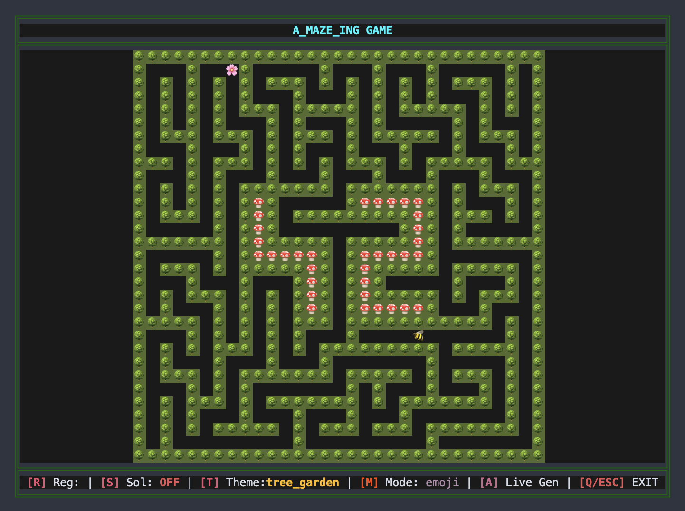

*This project has been created as part of the 42 curriculum by <cbruma>, <skorenev>.*

# A-Maze-ing

## Description

A-Maze-ing is a maze generator and visualizer developed as part of the 42 curriculum.

The goal of the project is to generate a maze from a configuration file, find a path between a specified entry and exit point, save the generated maze in the required output format, and provide an interactive terminal visualization.

The project supports:

* configurable maze width and height;
* configurable entry and exit positions;
* perfect and imperfect mazes;
* deterministic generation using an optional seed;
* multiple maze generation algorithms;
* path finding between the entry and exit;
* terminal-based visualization;
* different visual themes;
* interactive controls;
* configuration validation with clear error messages.

The project is written in Python and uses `uv` for dependency and environment management.

## Instructions

### Requirements

* Python 3.14 or later
* `uv`

The project uses `uv` to create the virtual environment and install dependencies.

### Installation

Install the project dependencies:

```bash
make install
```

This runs:

```bash
uv sync
```

### Running the project

The program expects a configuration file as its argument:

```bash
make run
```

which is equivalent to:

```bash
uv run python3 a_maze_ing.py config.txt
```

The generated maze is displayed in the terminal. Depending on the selected options, the program also provides an interactive interface for navigating and inspecting the maze.

### Debugging

The project uses Python's built-in `pdb` debugger:

```bash
make debug
```

This runs:

```bash
uv run python3 -m pdb a_maze_ing.py config.txt
```

### Linting and type checking

Run the standard checks with:

```bash
make lint
```

For stricter mypy checking:

```bash
make lint-strict
```

### Cleaning generated Python cache files

```bash
make clean
```

This removes Python bytecode caches and the mypy cache.

## Configuration File

The program receives its configuration from a text file.

A configuration file contains one setting per line in the following format:

```text
WIDTH=15
HEIGHT=15
ENTRY=10,10
EXIT=3,0
OUTPUT_FILE=maze.txt
PERFECT=False
SEED=42
ALGORITHM=dfs
```

### Configuration parameters

| Parameter     | Required | Description                                                        |
| ------------- | -------- | ------------------------------------------------------------------ |
| `WIDTH`       | Yes      | Width of the maze. Must be a positive integer.                     |
| `HEIGHT`      | Yes      | Height of the maze. Must be a positive integer.                    |
| `ENTRY`       | Yes      | Entry coordinates in `x,y` format.                                 |
| `EXIT`        | Yes      | Exit coordinates in `x,y` format.                                  |
| `OUTPUT_FILE` | Yes      | File where the generated maze is written.                          |
| `PERFECT`     | No       | Controls whether a perfect maze is generated. Defaults to `False`. |
| `SEED`        | No       | Not negative integer seed used to make maze generation             |
|               |          | reproducible.                                                      |
| `ALGORITHM`   | No       | Maze generation algorithm. Defaults to `dfs`.                      |

Coordinates use the following convention:

```text
(0, 0) ───────────────► X
  │
  │
  │
  ▼
  Y
```

Therefore, `(x, y)` refers to column `x` and row `y`.

### Perfect and imperfect mazes

When `PERFECT=True`, the generator creates a perfect maze: there is exactly one path between any two cells.

When `PERFECT=False`, the generated board remains fully connected, allowing it to be used as a board for a Pac-Man-like game. Additional openings can therefore exist between different routes.

### Seed

The optional `SEED` parameter makes generation reproducible.

For example:

```text
SEED=42
```

Using the same configuration, algorithm, and seed produces the same deterministic generation process.

### Algorithm

The `ALGORITHM` parameter currently supports:

```text
ALGORITHM=dfs
```

and:

```text
ALGORITHM=prim
```

If no algorithm is specified, `dfs` is used.

## Maze Generation Algorithms

The project supports two maze generation algorithms: Depth-First Search (DFS) / Recursive Backtracker and Prim's algorithm.

### Depth-First Search / Recursive Backtracker

DFS is the default maze generation algorithm.

The algorithm starts from the selected entry cell and explores unvisited neighbouring cells. When a new cell is selected, the wall between the current cell and the new cell is removed. If no unvisited neighbour is available, the algorithm backtracks to a previous cell.

Conceptually:

```text
1. Start at the entry cell.
2. Mark the current cell as visited.
3. Find an unvisited neighbour.
4. Remove the wall between the two cells.
5. Move to the neighbour.
6. Repeat until there are no unvisited neighbours.
7. Backtrack when necessary.
```
A stack is used to keep track of the cells that can be revisited during backtracking.

#### Why DFS was chosen

DFS was chosen as the default algorithm because:

- it is relatively simple to implement and understand;
- it naturally produces connected mazes;
- it can generate perfect mazes;
- it works well with the cell-based representation used by the project;
- it provides a good balance between implementation complexity and maze generation requirements.

### Prim's Algorithm

The project also supports Prim's algorithm as an alternative maze generation method.

The algorithm starts from the selected entry cell and creates a collection of frontier cells — unvisited cells neighbouring the already generated part of the maze.

While frontier cells remain, the algorithm:

```
1. Select a random frontier cell.
2. Find its neighbouring cell that has already been visited.
3. Select one of the visited neighbours.
4. Remove the wall between the frontier cell and the visited cell.
5. Mark the frontier cell as visited.
6. Add its unvisited neighbours to the frontier.
7. Repeat until there are no frontier cells.
```
The project uses a list of frontier cells and randomly selects both the frontier cell and the visited neighbour. This produces a different maze structure from DFS while using the same cell and wall representation.

## A* Path Finding
After generating the maze, the project uses the A* algorithm to find a path from the configured entry point to the exit point.

A* combines the actual cost of reaching a cell (`g_score`) with an estimate of the remaining distance to the exit (`h_score`). The project uses Manhattan distance as the heuristic:
```
f_score = g_score + h_score
```
A priority queue is used to process cells with the lowest estimated total cost first.
```
1. Start at the entry cell.
2. Add the entry cell to the priority queue.
3. Select the cell with the lowest estimated total cost.
4. Check its accessible neighbours.
5. Calculate their tentative costs.
6. Update a neighbour if a shorter path has been found.
7. Continue until the exit is reached.
8. Reconstruct the path from the exit back to the entry.
```
The project stores the previous cell for each discovered position in `came_from`. Once the exit is reached, this information is used to reconstruct the path.

The resulting path is converted into a sequence of directions (`N`, `E`, `S`, `W`).

Path finding is separated from maze generation, so either maze generation algorithm can be used with the same A* path-finding implementation.
## Terminal Visualization

The project includes an interactive terminal interface implemented using the `blessed` library.

The project supports different display options, including themed and emoji-based rendering.

## Reusable Code

The project was designed so that the main components can be reused independently.

### Configuration

The configuration parser and models are separated from the rest of the application:

```text
config/
├── models.py
└── parser.py
```

This makes it possible to reuse the configuration validation and parsing logic in another application without depending on the maze generator or UI.

### Maze generation

Maze generation is isolated in:

```text
maze/generate_maze.py
```

The generator operates on the maze model rather than directly on terminal output. This means that another UI or output format can be added without changing the generation algorithm.

The same generator can also be used with different algorithms through the `ALGORITHM` configuration option.

### Path finding

Path finding is implemented separately from maze generation:

```text
maze/find_path.py
```

This separation means that different path-finding strategies can be introduced without rewriting the maze generator.

### UI

The terminal interface is separated from the maze logic. The generated maze can therefore be converted into another representation or displayed using another interface without changing the underlying generation algorithm.

## Team and Project Management

### Team

- *cbruma* — responsible for the terminal interface, visual presentation, themes, display modes, and project documentation.
- *skorenev* — responsible for configuration parsing and validation, maze generation algorithms, path finding, and related maze logic.
- *Both team members* — responsible for testing, debugging, identifying issues, and fixing bugs together.


### Initial Planning

The project was initially divided into several main areas:

1. Configuration parsing and validation.
2. Maze data structures.
3. Maze generation.
4. Path finding.
5. Output file generation.
6. Terminal visualization.
7. Testing and validation.
8. Documentation and project tooling.

The initial implementation focused on creating a working maze generator and satisfying the mandatory output requirements before adding optional functionality.

### How the Plan Evolved

During development, the project evolved beyond the initial maze generation implementation.

Additional work included:

* supporting more than one maze generation algorithm;
* separating maze logic from terminal rendering;
* adding an interactive terminal UI;
* adding themes and different display modes;
* moving dependency management to `uv`;

The development process therefore shifted from implementing a single generator to building separate, reusable components for generation, solving, output, and visualization.

### What Worked Well

The separation between configuration, maze logic, and UI worked well because changes in one part of the project could be made without heavily modifying the others.

Using a dedicated maze model also made it easier to reason about walls, visited cells, paths, and special cells.

Using a seed for random generation was useful for debugging because the same maze could be reproduced when investigating a problem.

Separating error handling into custom exceptions also made it possible to display configuration errors to the user without exposing unnecessary implementation details.

### What Could Be Improved

Possible improvements for a future version include:

* expanding automated test coverage;
* improving the abstraction between different maze generation algorithms;
* adding more automated checks for generated maze properties;
* improving documentation of the internal maze representation;
* adding performance measurements for larger mazes;
* adding additional generation and path-finding algorithms.

## Tools

The following tools were used during development:

### Python

The main programming language used for the project.

### Blessed

Used for terminal control, keyboard input, cursor handling, fullscreen mode, and terminal rendering.

### Pydantic

Used for configuration validation and data modelling.

### uv

Used for Python environment management and dependency management.

The project's dependencies are declared in `pyproject.toml`, while `uv.lock` records the resolved versions.

### Make

Used to provide convenient commands for installation, execution, debugging, linting, and cleaning.

### Git

Used for version control and project development.

## Resources

### Official Documentation

* Python documentation: https://docs.python.org/3/
* pip documentation: https://pip.pypa.io/en/stable/
* uv documentation: https://docs.astral.sh/uv/
* Blessed documentation: https://blessed.readthedocs.io/
* Pydantic documentation: https://docs.pydantic.dev/

### Maze Generation

* Wikipedia — Maze generation algorithms: https://en.wikipedia.org/wiki/Maze_generation_algorithm
* Wikipedia — Depth-first search: https://en.wikipedia.org/wiki/Depth-first_search
* Wikipedia — Prim's algorithm: https://en.wikipedia.org/wiki/Prim%27s_algorithm
* Wikipedia — A* search algorithm: https://en.wikipedia.org/wiki/A*_search_algorithm

During development, we also used:

* **YouTube** — tutorials and practical explanations of Python, terminal interfaces, maze generation algorithms, and related topics.
* **Stack Overflow** — solutions and discussions about specific Python and development issues.

### AI-assisted development

AI tools were used as a development support tool rather than as a replacement for understanding or testing the code.

AI assistance was used for:

* explaining Python language features and standard-library concepts;
* reviewing code structure and suggesting refactorings;
* improving project documentation and README structure.
* researching and comparing terminal interface libraries, including choosing **Blessed** as a Python-friendly alternative to lower-level terminal libraries such as `curses`;

## Example

A minimal configuration can look like:

```text
WIDTH=15
HEIGHT=15
ENTRY=10,10
EXIT=3,0
OUTPUT_FILE=maze.txt
PERFECT=False
SEED=42
ALGORITHM=dfs
```

The program can then be started with:

```bash
make run
```

For example, the generated maze can be displayed in the terminal as follows:


The maze is generated, the path from the entry to the exit is calculated, and the resulting maze is written to the configured output file and displayed in the terminal.
